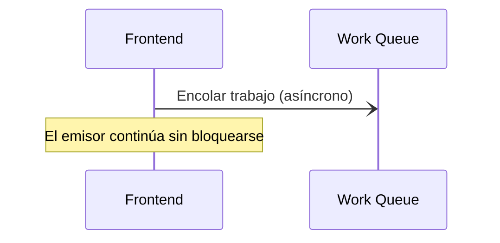

## ⚡ ¿Cómo graficar Asincronismo?

### 1. La Sintaxis Oficial (Flecha de Línea Continua con Punta Abierta)
En UML, un mensaje asíncrono se representa con una flecha con punta abierta `-)` (en lugar de la punta rellena `->>`). El emisor no espera respuesta y continúa inmediatamente.

