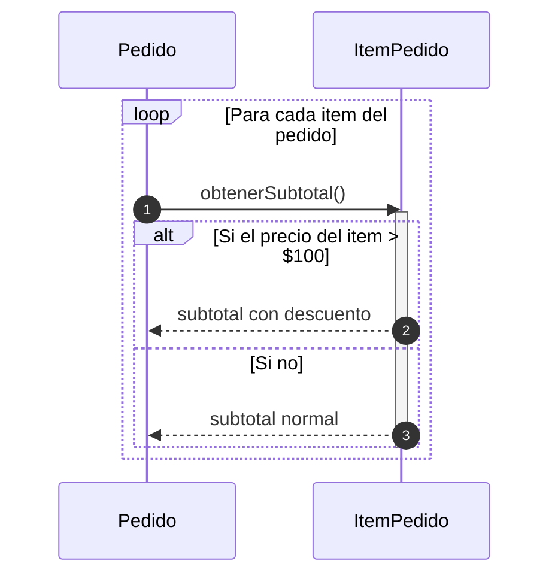

## 🔁 Bucles y Alternativas (loop / alt)

Representar flujos condicionales e iterativos en diagramas de secuencia.

  ⚠️ <strong>Recomendación Práctica:</strong> 
  Aunque esta sintaxis es 100% válida en UML, incluir bucles y alternativas complejas suele dificultar la lectura y el mantenimiento del diagrama. 
  Salvo que sea estrictamente necesario para comunicar la lógica, <strong>recomendamos diseñar un diagrama de secuencia limpio y lineal para cada situación o escenario</strong>.

