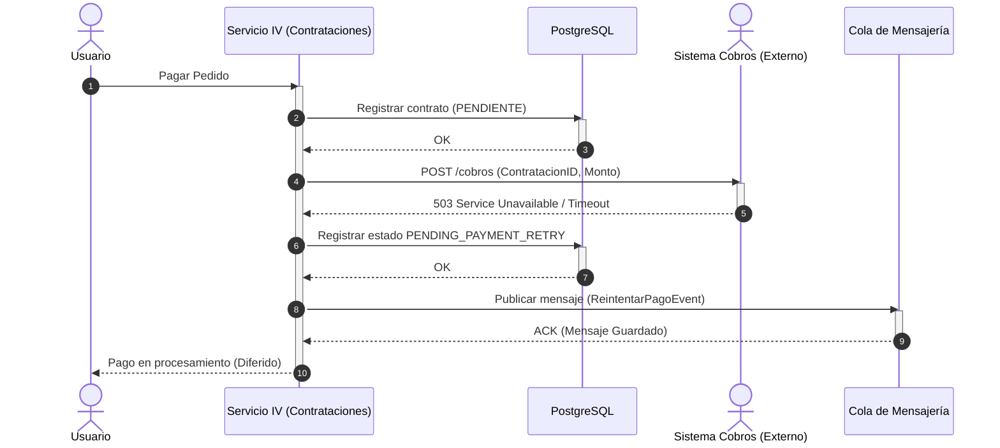

## Caso 2 - Escenario B: Falla externa y reintentos

La API externa está caída. Registramos el estado pendiente y encolamos un reintento.

  ⚠️ <strong>Pregunta disparadora:</strong> ¿Qué pasa si el servidor se apaga justo antes de enviar el mensaje a la cola?  
  * Para profundizar en consistencia y resiliencia ver: <strong>Patrón Retry</strong> y <strong>Patrón Transactional Outbox (Doble Escritura)</strong>.

