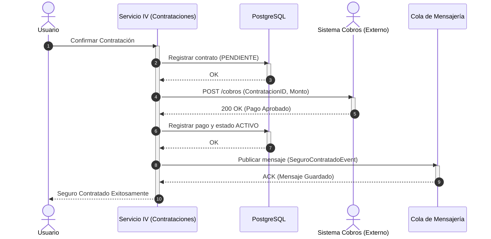

## Caso 2 - Escenario A: Caso Feliz

Registro local conceptual, llamada externa síncrona y notificación asíncrona por cola de mensajería.

```mermaid
sequenceDiagram
  autonumber
  actor Usuario
  participant Service as Servicio IV (Contrataciones)
  participant DB as PostgreSQL
  actor Cobros as Sistema Cobros (Externo)
  participant Queue as Cola de Mensajería

  Usuario->>Service: Confirmar Contratación
  activate Service
  
  Service->>DB: Registrar contrato (PENDIENTE)
  activate DB
  DB-->>Service: OK
  deactivate DB

  Service->>Cobros: POST /cobros (ContratacionID, Monto)
  activate Cobros
  Cobros-->>Service: 200 OK (Pago Aprobado)
  deactivate Cobros

  Service->>DB: Registrar pago y estado ACTIVO
  activate DB
  DB-->>Service: OK
  deactivate DB

  Service->>Queue: Publicar mensaje (SeguroContratadoEvent)
  activate Queue
  Queue-->>Service: ACK (Mensaje Guardado)
  deactivate Queue
  
  Service-->>Usuario: Seguro Contratado Exitosamente
  deactivate Service
```
