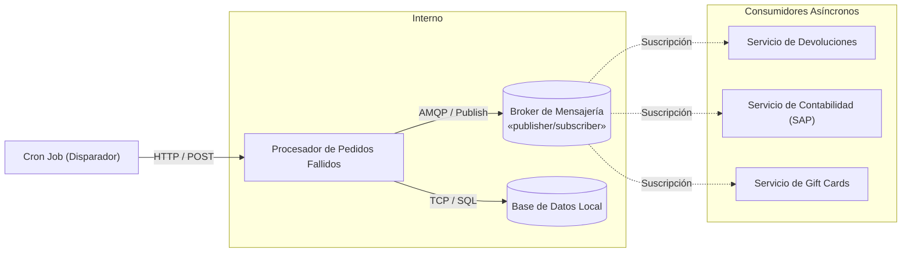

## 📬 Caso de Estudio 3: Comunicación Asíncrona (Pub-Sub)

  <strong>¿Qué estamos viendo?</strong> 
  Un disparador temporal (Cron) inicia el proceso de limpieza y conciliación. El <em>Procesador de Pedidos Fallidos</em> consulta su <em>Base de Datos Local</em> para obtener la lista de transacciones fallidas de ayer. Luego, en lugar de acoplarse con cada sistema destinatario, publica los eventos en el Broker de Mensajería para que los suscriptores los procesen asíncronamente.

