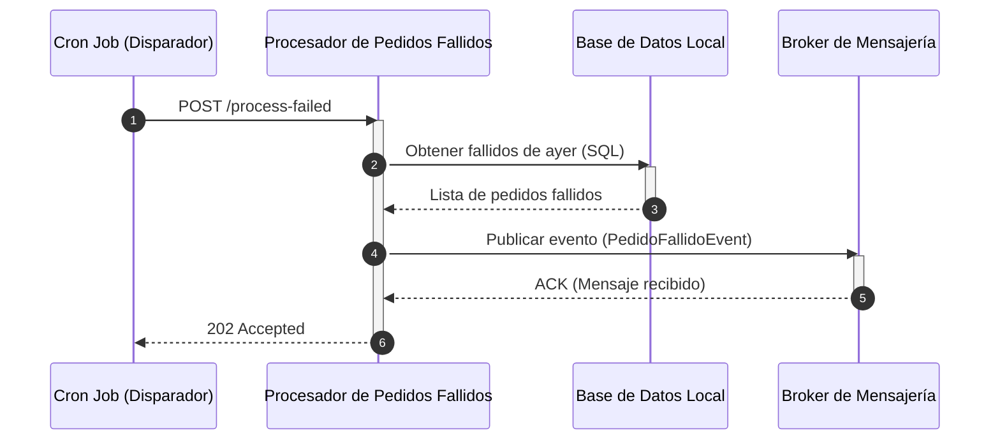

## Caso 3: Secuencia de Publicación Asíncrona

El proceso disparado por el Cron se comunica indirectamente con los consumidores mediante la cola.

  <strong>Explicación del flujo:</strong> 
  El Cron envía un POST al Procesador. Éste realiza una consulta SQL a la Base de Datos Local para traer los pedidos fallidos del día de ayer. Luego, para cada pedido fallido, publica un evento en el Broker de Mensajería. Al recibir el ACK de confirmación del broker, el Procesador responde de inmediato al Cron con un 202 Accepted.

