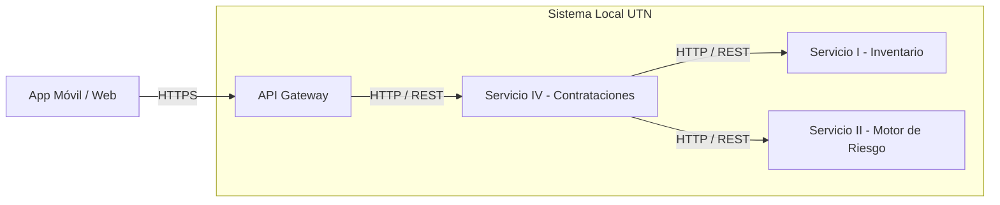

## 🛠️ Caso de Estudio 1: Microservicios Sincrónicos

```mermaid
graph LR
  Client["App Móvil / Web"] -->|HTTPS| Gateway["API Gateway"]
  subgraph local [Sistema Local UTN]
    Gateway -->|HTTP / REST| Contrataciones["Servicio IV - Contrataciones"]
    Contrataciones -->|HTTP / REST| Inventario["Servicio I - Inventario"]
    Contrataciones -->|HTTP / REST| Riesgo["Servicio II - Motor de Riesgo"]
  end
```
