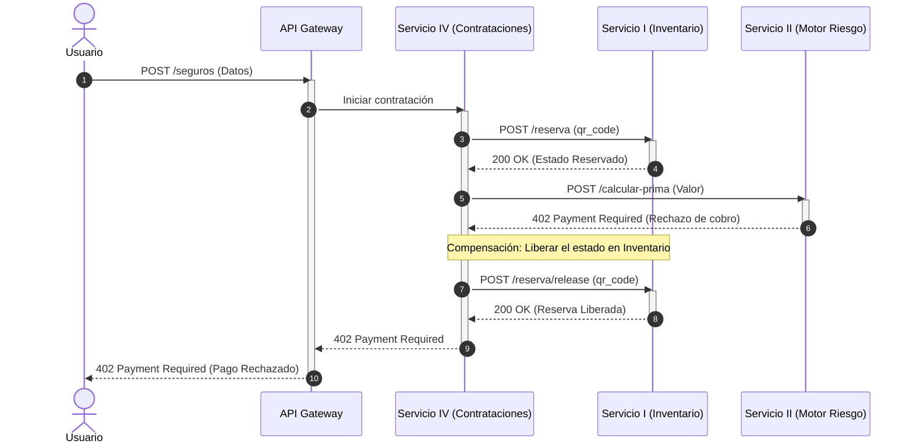

## Caso 1 - Escenario B: Falla y Compensación

El pago es rechazado y se ejecuta una compensación para liberar el estado de reserva del equipo.

  ⚠️ <strong>Pregunta disparadora:</strong> ¿Qué pasa si falla la red al intentar liberar el stock?  
  * Para profundizar en consistencia distribuida ver: <strong>Patrón Saga (Compensaciones)</strong> e <strong>Idempotencia</strong>.

