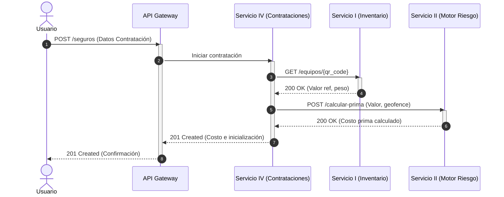

## Caso 1 - Escenario A: Caso Feliz

Flujo sincrónico completo de inicialización y cálculo de prima aprobado con éxito.

```mermaid
sequenceDiagram
  autonumber
  actor Usuario
  participant Gateway as API Gateway
  participant Contrataciones as Servicio IV (Contrataciones)
  participant Inventario as Servicio I (Inventario)
  participant Riesgo as Servicio II (Motor Riesgo)

  Usuario->>Gateway: POST /seguros (Datos Contratación)
  activate Gateway
  Gateway->>Contrataciones: Iniciar contratación
  activate Contrataciones
  
  Contrataciones->>Inventario: GET /equipos/{qr_code}
  activate Inventario
  Inventario-->>Contrataciones: 200 OK (Valor ref, peso)
  deactivate Inventario

  Contrataciones->>Riesgo: POST /calcular-prima (Valor, geofence)
  activate Riesgo
  Riesgo-->>Contrataciones: 200 OK (Costo prima calculado)
  deactivate Riesgo

  Contrataciones-->>Gateway: 201 Created (Costo e inicialización)
  deactivate Contrataciones
  Gateway-->>Usuario: 201 Created (Confirmación)
  deactivate Gateway
```
