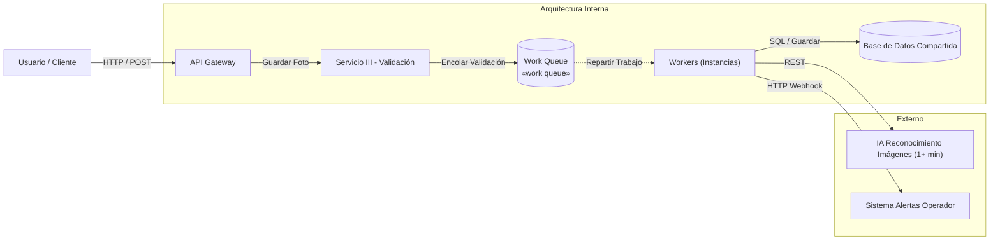

## 👥 Caso de Estudio 4: Cola de Trabajo (Work Queue)

  <strong>¿Qué estamos viendo?</strong> 
  Dado que la validación por IA toma más de 1 minuto, el flujo se divide en dos fases: la <strong>Submisión</strong> (el Frontend recibe la foto y la encola de forma inmediata) y el <strong>Procesamiento</strong> (un pool de Workers asíncronos distribuidos toma los trabajos de la cola, llama al servicio de IA externa y guarda el resultado en la Base de Datos compartida, notificando si es necesario mediante un Webhook).

