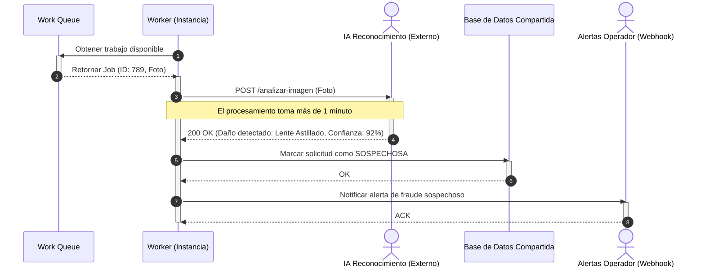

## Caso 4: Secuencia - Parte B (Procesamiento por el Worker)

De forma completamente desacoplada, el Worker toma la tarea, la procesa y notifica externamente.

```mermaid
sequenceDiagram
  autonumber
  participant Queue as Work Queue
  participant Worker as Worker (Instancia)
  actor AI as IA Reconocimiento (Externo)
  participant DB as Base de Datos Compartida
  actor Operador as Alertas Operador (Webhook)

  Worker->>Queue: Obtener trabajo disponible
  activate Queue
  Queue-->>Worker: Retornar Job (ID: 789, Foto)
  deactivate Queue
  activate Worker
  
  Worker->>AI: POST /analizar-imagen (Foto)
  activate AI
  Note over Worker,AI: El procesamiento toma más de 1 minuto
  AI-->>Worker: 200 OK (Daño detectado: Lente Astillado, Confianza: 92%)
  deactivate AI
  
  Worker->>DB: Marcar solicitud como SOSPECHOSA
  activate DB
  DB-->>Worker: OK
  deactivate DB
  
  Worker->>Operador: Notificar alerta de fraude sospechoso
  activate Operador
  Operador-->>Worker: ACK
  deactivate Operador
  deactivate Worker
```
