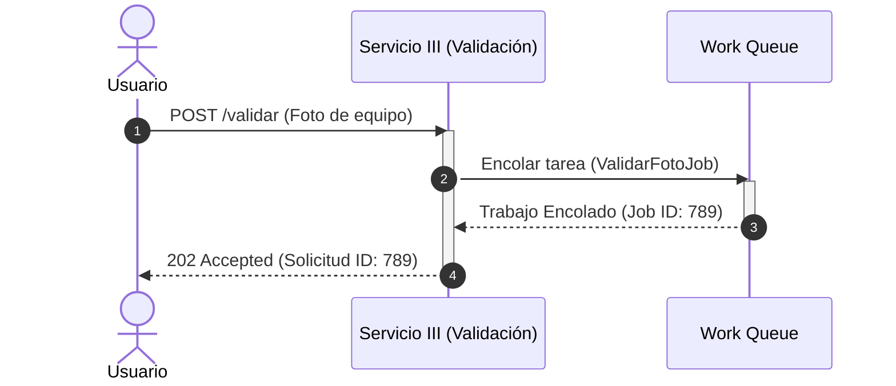

## Caso 4: Secuencia - Parte A (Submisión del Trabajo)

El Frontend recibe los documentos, encola la tarea y le responde al cliente de inmediato (NO espera a que se complete el job del worker).

```mermaid
sequenceDiagram
  autonumber
  actor Usuario
  participant Service as Servicio III (Validación)
  participant Queue as Work Queue

  Usuario->>Service: POST /validar (Foto de equipo)
  activate Service
  Service->>Queue: Encolar tarea (ValidarFotoJob)
  activate Queue
  Queue-->>Service: Trabajo Encolado (Job ID: 789)
  deactivate Queue
  Service-->>Usuario: 202 Accepted (Solicitud ID: 789)
  deactivate Service
```
