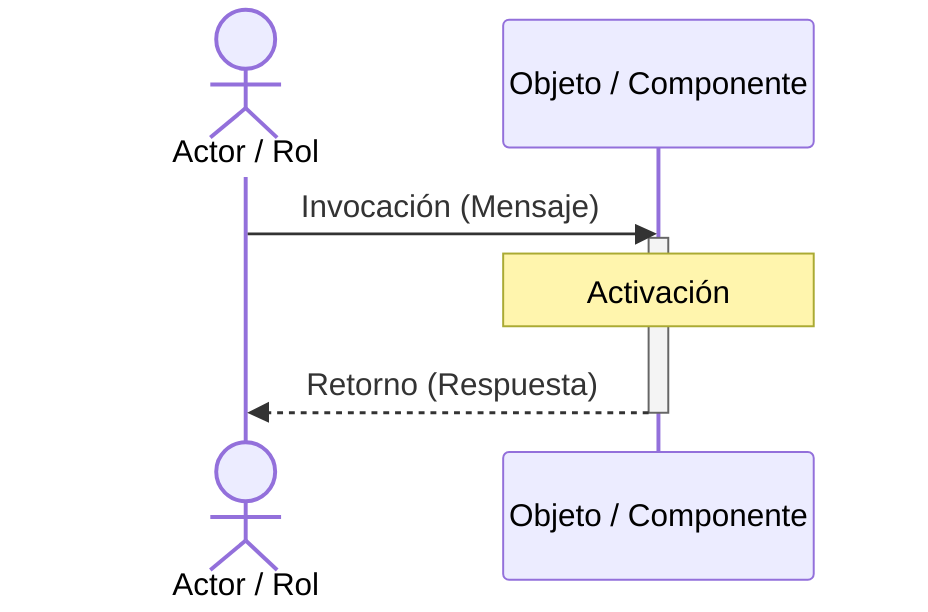

## 🔍 Elementos Clave del Diagrama de Secuencia

Una referencia rápida de los componentes visuales esenciales en UML:

  <h3 class="text-indigo-400 mb-4 text-center">Ejemplo Visual</h3>

  <table class="w-full text-xs text-slate-300">
    <thead>
      <tr class="border-b border-slate-700 text-left text-indigo-400 font-bold">
        <th class="pb-2">Elemento</th>
        <th class="pb-2">UML</th>
        <th class="pb-2">Descripción</th>
      </tr>
    </thead>
    <tbody>
      <tr class="border-b border-slate-800">
        <td class="py-2 font-bold text-white">Objeto / Actor</td>
        <td class="py-2">Caja / Monigote</td>
        <td class="py-2">Instancia de una clase, componente de software o rol humano.</td>
      </tr>
      <tr class="border-b border-slate-800">
        <td class="py-2 font-bold text-white">Línea de Vida</td>
        <td class="py-2">Línea vertical punteada</td>
        <td class="py-2">Indica la presencia temporal del objeto en el tiempo.</td>
      </tr>
      <tr class="border-b border-slate-800">
        <td class="py-2 font-bold text-white">Línea de Activación</td>
        <td class="py-2">Barra/Caja vertical blanca</td>
        <td class="py-2">Indica cuándo el objeto está ejecutando una acción o en memoria.</td>
      </tr>
      <tr class="border-b border-slate-800">
        <td class="py-2 font-bold text-white">Mensaje</td>
        <td class="py-2">Flecha sólida <code>-&gt;&gt;</code></td>
        <td class="py-2">Llamada a un método o servicio (sincrónico/asincrónico).</td>
      </tr>
      <tr>
        <td class="py-2 font-bold text-white">Retorno</td>
        <td class="py-2">Flecha punteada <code>--&gt;&gt;</code></td>
        <td class="py-2">Respuesta con datos de retorno del servicio invocado.</td>
      </tr>
    </tbody>
  </table>

