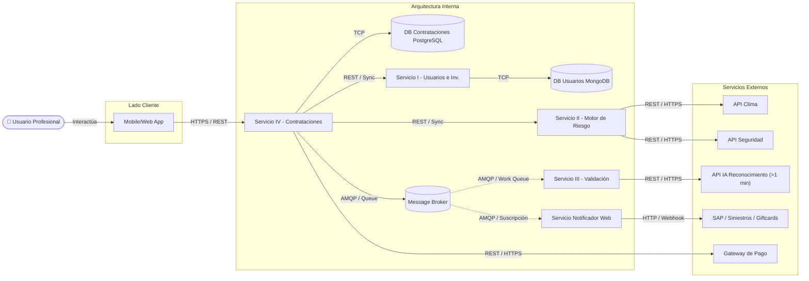

## 🛠️ Resolución: Arquitectura de la Solución (ProtegePro)

  <strong>Seguridad e Integraciones:</strong> 
  No se permite la suscripción directa de sistemas externos (SAP, Siniestros) a nuestro Message Broker interno. En su lugar, el <strong>Servicio Notificador Web</strong> se suscribe al broker local y se encarga de empujar (push) las notificaciones hacia las pasarelas externas mediante <strong>HTTP/Webhooks</strong>.

