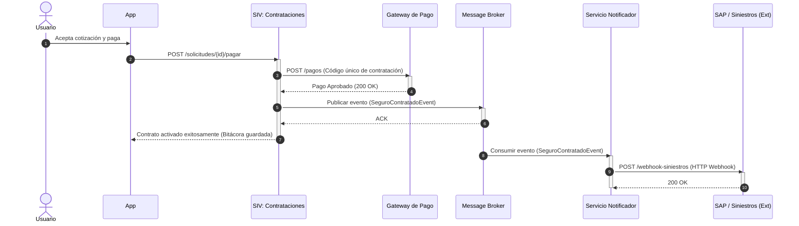

## 🛠️ Resolución: Fase 2 (Cobro y Activación)

Fase final transaccional: cobro sincrónico y aprovisionamiento/notificación asíncrona.

```mermaid
sequenceDiagram
    autonumber
    actor Usuario
    participant App
    participant S4 as SIV: Contrataciones
    participant SisCobro as Gateway de Pago
    participant Broker as Message Broker
    participant Notificador as Servicio Notificador
    participant SAP as SAP / Siniestros (Ext)

    Usuario->>App: Acepta cotización y paga
    App->>S4: POST /solicitudes/{id}/pagar
    activate S4
    
    S4->>SisCobro: POST /pagos (Código único de contratación)
    activate SisCobro
    SisCobro-->>S4: Pago Aprobado (200 OK)
    deactivate SisCobro
    
    S4->>Broker: Publicar evento (SeguroContratadoEvent)
    activate Broker
    Broker-->>S4: ACK
    deactivate Broker
    
    S4-->>App: Contrato activado exitosamente (Bitácora guardada)
    deactivate S4
    
    Broker->>Notificador: Consumir evento (SeguroContratadoEvent)
    activate Notificador
    Notificador->>SAP: POST /webhook-siniestros (HTTP Webhook)
    activate SAP
    SAP-->>Notificador: 200 OK
    deactivate SAP
    deactivate Notificador
```
