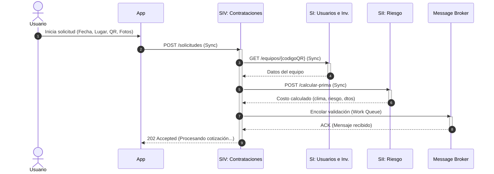

## 🛠️ Resolución: Fase 1.A (Cotización y Encolado)

Flujo sincrónico inicial: cotización de prima y encolado de la tarea de validación.

```mermaid
sequenceDiagram
    autonumber
    actor Usuario
    participant App
    participant S4 as SIV: Contrataciones
    participant S1 as SI: Usuarios e Inv.
    participant S2 as SII: Riesgo
    participant Broker as Message Broker

    Usuario->>App: Inicia solicitud (Fecha, Lugar, QR, Fotos)
    App->>S4: POST /solicitudes (Sync)
    activate S4
    
    S4->>S1: GET /equipos/{codigoQR} (Sync)
    activate S1
    S1-->>S4: Datos del equipo
    deactivate S1
    
    S4->>S2: POST /calcular-prima (Sync)
    activate S2
    S2-->>S4: Costo calculado (clima, riesgo, dtos)
    deactivate S2
    
    S4->>Broker: Encolar validación (Work Queue)
    activate Broker
    Broker-->>S4: ACK (Mensaje recibido)
    deactivate Broker
    
    S4-->>App: 202 Accepted (Procesando cotización...)
    deactivate S4
```
