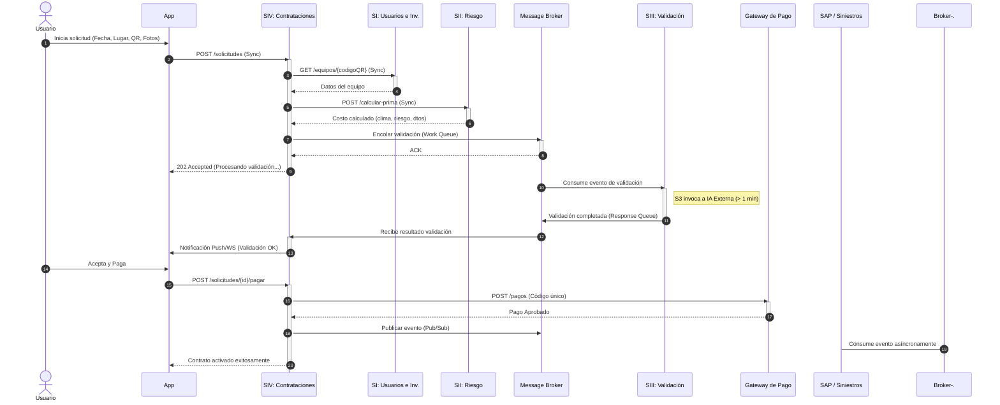

## 🛠️ Resolución: Secuencia de Contratación (Happy Path)

```mermaid
sequenceDiagram
    autonumber
    actor Usuario
    participant App
    participant S4 as SIV: Contrataciones
    participant S1 as SI: Usuarios e Inv.
    participant S2 as SII: Riesgo
    participant Broker as Message Broker
    participant S3 as SIII: Validación
    participant SisCobro as Gateway de Pago
    participant SAP as SAP / Siniestros

    Usuario->>App: Inicia solicitud (Fecha, Lugar, QR, Fotos)
    App->>S4: POST /solicitudes (Sync)
    activate S4
    
    S4->>S1: GET /equipos/{codigoQR} (Sync)
    activate S1
    S1-->>S4: Datos del equipo
    deactivate S1
    
    S4->>S2: POST /calcular-prima (Sync)
    activate S2
    S2-->>S4: Costo calculado (clima, riesgo, dtos)
    deactivate S2
    
    S4->>Broker: Encolar validación (Work Queue)
    activate Broker
    Broker-->>S4: ACK
    deactivate Broker
    
    S4-->>App: 202 Accepted (Procesando validación...)
    deactivate S4
    
    Broker->>S3: Consume evento de validación
    activate S3
    note right of S3: S3 invoca a IA Externa (> 1 min)
    S3->>Broker: Validación completada (Response Queue)
    deactivate S3
    
    Broker->>S4: Recibe resultado validación
    activate S4
    S4->>App: Notificación Push/WS (Validación OK)
    deactivate S4
    
    Usuario->>App: Acepta y Paga
    App->>S4: POST /solicitudes/{id}/pagar
    activate S4
    
    S4->>SisCobro: POST /pagos (Código único)
    activate SisCobro
    SisCobro-->>S4: Pago Aprobado
    deactivate SisCobro
    
    S4->>Broker: Publicar evento (Pub/Sub)
    Broker-.->SAP: Consume evento asíncronamente
    
    S4-->>App: Contrato activado exitosamente
    deactivate S4
```
