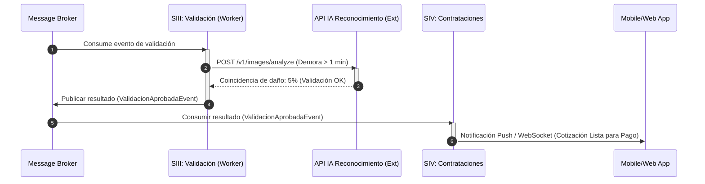

## 🛠️ Resolución: Fase 1.B (Procesamiento por Worker)

Flujo asíncrono en segundo plano: validación por IA y notificación al usuario.

```mermaid
sequenceDiagram
    autonumber
    participant Broker as Message Broker
    participant S3 as SIII: Validación (Worker)
    participant IA as API IA Reconocimiento (Ext)
    participant S4 as SIV: Contrataciones
    participant App as Mobile/Web App

    Broker->>S3: Consume evento de validación
    activate S3
    
    S3->>IA: POST /v1/images/analyze (Demora > 1 min)
    activate IA
    IA-->>S3: Coincidencia de daño: 5% (Validación OK)
    deactivate IA
    
    S3->>Broker: Publicar resultado (ValidacionAprobadaEvent)
    deactivate S3
    
    Broker->>S4: Consumir resultado (ValidacionAprobadaEvent)
    activate S4
    S4->>App: Notificación Push / WebSocket (Cotización Lista para Pago)
    deactivate S4
```
