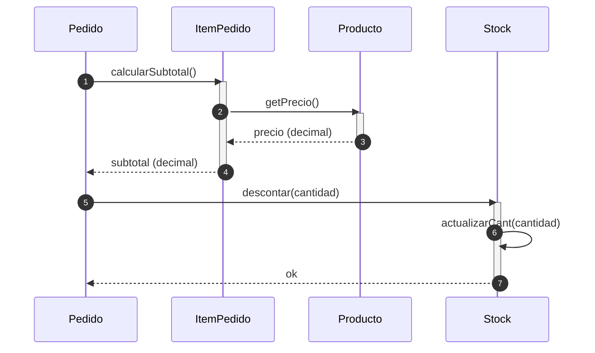

## 🧭 1. El Diagrama de Secuencia Tradicional

### Enfoque clásico: Colaboración de Objetos de Dominio
*   **Participantes:** Instancias de clases del modelo de dominio.
*   **Mensajes:** Envío de mensajes locales en memoria (llamadas a métodos).
*   **Ámbito:** Todo ocurre dentro de un único proceso de ejecución (sin red ni latencia).

