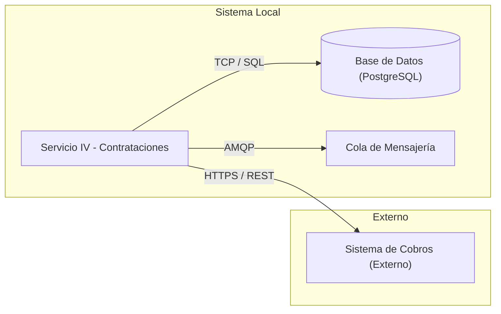

## ⚡ Zoom en un microservicio

```mermaid
graph LR
  subgraph local [Sistema Local]
    Service["Servicio IV - Contrataciones"]
    DB[("Base de Datos (PostgreSQL)")]
    Queue["Cola de Mensajería"]
  end
  subgraph ext [Externo]
    CobrosAPI["Sistema de Cobros (Externo)"]
  end
  Service -->|TCP / SQL| DB
  Service -->|AMQP| Queue
  Service -->|HTTPS / REST| CobrosAPI
```
